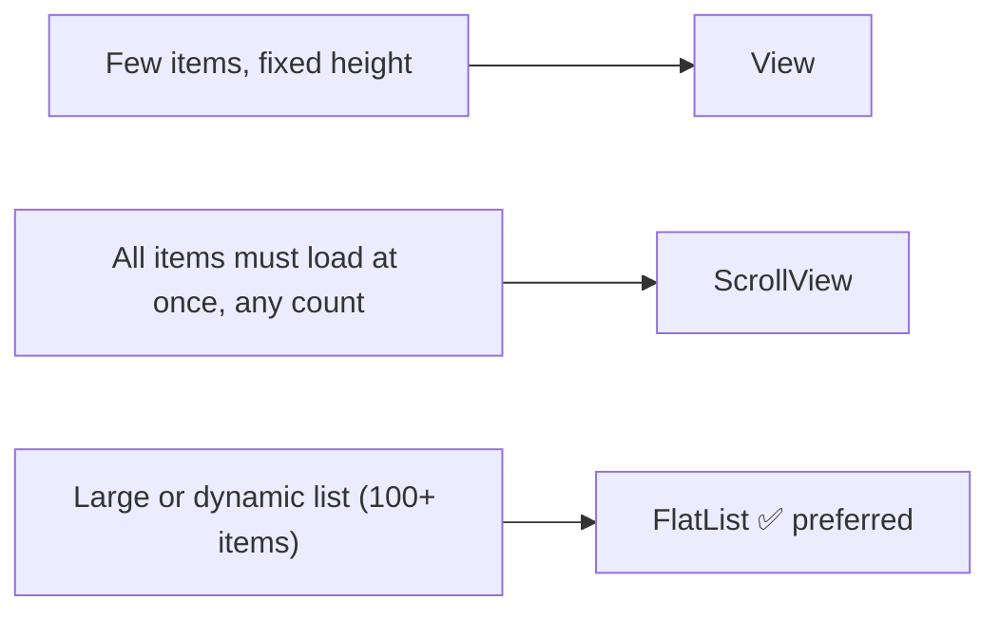
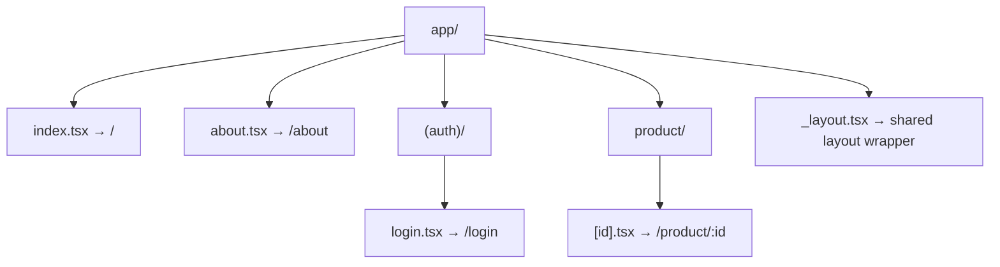
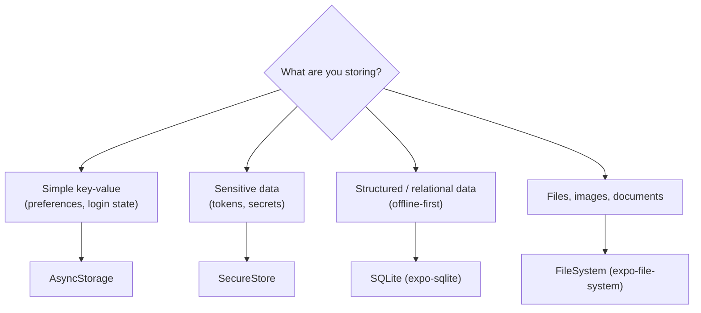
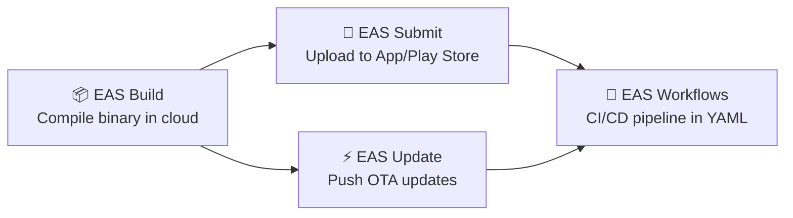
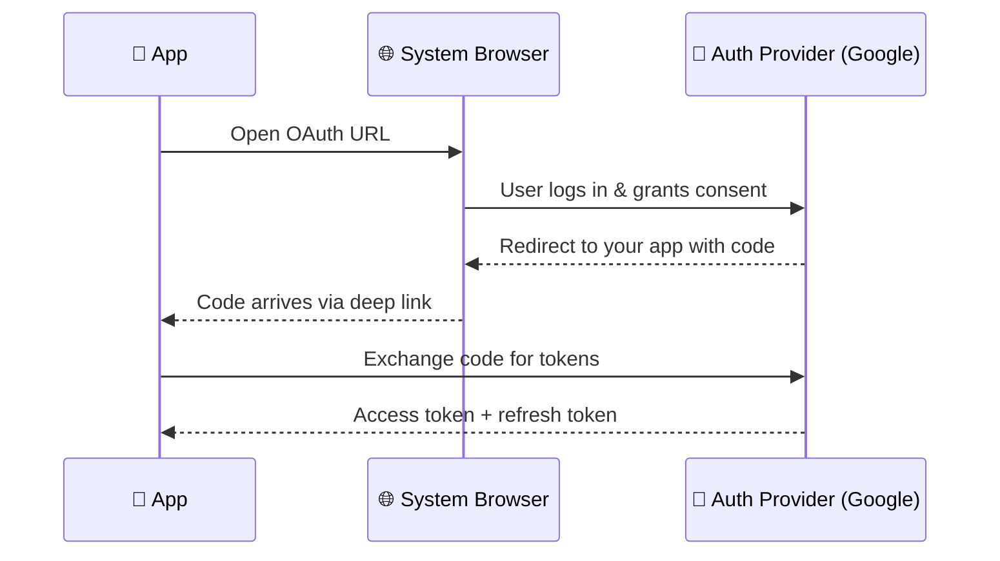
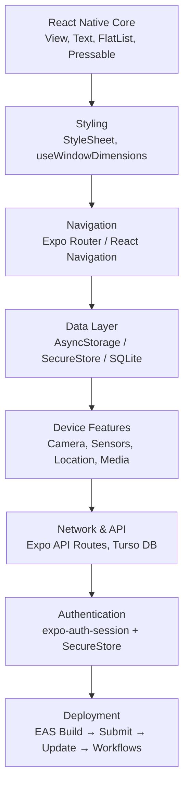

# React Native & Expo — Complete Course Notes

> **How to use these notes:** Each class builds on the previous. Code blocks are ready to copy-paste. Practice projects appear at natural checkpoints so you consolidate multiple concepts before moving on.

---

## Table of Contents

1. [Core Components](#class-1-core-components)
2. [Styling & Responsiveness](#class-2-styling--responsiveness)
3. [React Navigation](#class-3-react-navigation)
4. [Expo Router — File-Based Routing](#class-4-expo-router--file-based-routing)
5. [Expo API Routes & Database](#class-5-expo-api-routes--database)
6. [Data Storage & Offline Support](#class-6-data-storage--offline-support)
7. [Sensors & Motion — Part 1](#class-7-sensors--motion-part-1)
8. [Sensors & Motion — Part 2](#class-8-sensors--motion-part-2)
9. [EAS Build, Submit, Update & Workflows](#class-9--10-eas-build-submit-update--workflows)
10. [Camera, Audio & Media](#class-11-camera-audio--media)
11. [Media Library, Network & Battery](#class-12-media-library-network--battery)
12. [Expo Authentication](#class-14-expo-authentication)

---

## Class 1 — Core Components

### What are Core Components?

React Native ships a set of **built-in UI primitives** that map directly to native iOS and Android widgets. You never touch HTML — you use these components instead.

### Component Reference

| Component | Purpose | Key Props |
|---|---|---|
| `View` | The fundamental layout box (like `<div>`) | `style`, `accessible` |
| `ScrollView` | A scrollable container — loads *all* children at once | `horizontal`, `showsVerticalScrollIndicator` |
| `FlatList` | Performant list — renders only visible rows | `data`, `renderItem`, `keyExtractor` |
| `Text` | Display text — the only component that can contain text | `numberOfLines`, `onPress` |
| `Image` | Display images (local or remote) | `source`, `resizeMode` |
| `ImageBackground` | Render a background image behind child components | `source`, `style` |
| `TextInput` | Single or multi-line text input field | `value`, `onChangeText`, `multiline` |
| `Button` | A simple native button | `title`, `onPress`, `color` |
| `Pressable` | Flexible touch handler — the modern way to make anything tappable | `onPress`, `onLongPress`, `style` |
| `Switch` | A boolean toggle control | `value`, `onValueChange` |
| `StyleSheet` | Optimises style objects (see Class 2) | `.create()`, `.compose()` |
| `SafeAreaView` | Pads content away from notches/home bars | — |
| `KeyboardAvoidingView` | Shifts content up when the keyboard appears | `behavior` (`padding`/`height`/`position`) |

### `View` vs `ScrollView` vs `FlatList`



> **Critical difference:** `ScrollView` mounts **all** its children immediately, even if they're off-screen. `FlatList` is virtualised — it only renders what's visible, making it far more memory-efficient for long lists.

### Quick Code Examples

```jsx
// FlatList — the right way to render a list
import { FlatList, Text, View } from 'react-native';

const DATA = [
  { id: '1', name: 'Pikachu' },
  { id: '2', name: 'Charmander' },
];

export default function PokemonList() {
  return (
    <FlatList
      data={DATA}
      keyExtractor={(item) => item.id}
      renderItem={({ item }) => (
        <View style={{ padding: 12 }}>
          <Text>{item.name}</Text>
        </View>
      )}
    />
  );
}
```

```jsx
// Pressable — preferred over TouchableOpacity
import { Pressable, Text } from 'react-native';

<Pressable
  onPress={() => console.log('Pressed!')}
  style={({ pressed }) => ({
    opacity: pressed ? 0.6 : 1,
    backgroundColor: '#6200ea',
    padding: 12,
    borderRadius: 8,
  })}
>
  <Text style={{ color: 'white' }}>Tap me</Text>
</Pressable>
```

```jsx
// KeyboardAvoidingView — wrap your form in this
import { KeyboardAvoidingView, Platform } from 'react-native';

<KeyboardAvoidingView
  behavior={Platform.OS === 'ios' ? 'padding' : 'height'}
>
  {/* form fields go here */}
</KeyboardAvoidingView>
```

---

## Class 2 — Styling & Responsiveness

### `StyleSheet`

`StyleSheet.create()` validates your style objects at build time and moves them off the JS thread — always prefer it over inline objects.

```jsx
import { StyleSheet, View, Text } from 'react-native';

const styles = StyleSheet.create({
  container: { flex: 1, padding: 16, backgroundColor: '#fff' },
  title:     { fontSize: 24, fontWeight: '700', color: '#111' },
});

export default function App() {
  return (
    <View style={styles.container}>
      <Text style={styles.title}>Hello</Text>
    </View>
  );
}
```

#### Three `StyleSheet` utility methods

| Method | What it does | Example |
|---|---|---|
| `StyleSheet.create(obj)` | Creates and validates a style map | `StyleSheet.create({ box: { width: 50 } })` |
| `StyleSheet.compose(a, b)` | Merges two styles — right side wins on conflict | `StyleSheet.compose(styles.base, styles.override)` |
| `StyleSheet.flatten(arr)` | Turns an array of styles into a plain object | `StyleSheet.flatten([styles.a, styles.b])` |

### Responsive Layout

#### `useWindowDimensions` — reacts to screen rotation

```jsx
import { useWindowDimensions, View } from 'react-native';

export default function ResponsiveBox() {
  const { width, height } = useWindowDimensions();

  return (
    <View style={{ width: width * 0.9, height: height * 0.3 }} />
  );
}
```

#### `useColorScheme` — dark/light mode support

```jsx
import { useColorScheme, Text } from 'react-native';

export default function ThemedText() {
  const scheme = useColorScheme(); // 'light' | 'dark' | null

  return (
    <Text style={{ color: scheme === 'dark' ? '#fff' : '#000' }}>
      Hello themed world
    </Text>
  );
}
```

### Accessibility Scales — `fontScale` & `scale`

```jsx
import { PixelRatio } from 'react-native';

// fontScale: user's preferred text size multiplier (from OS accessibility settings)
const fontScale  = PixelRatio.getFontScale();    // e.g. 1.0, 1.3, 1.5

// scale: device pixel density (physical px per CSS px)
const pixelRatio = PixelRatio.get();             // e.g. 2 (Retina), 3 (iPhone Pro)

// Practical use: scale a font size to respect user preferences
const accessibleFontSize = (size) => size / PixelRatio.getFontScale();
```

> **Why it matters:** If you hard-code `fontSize: 14`, a visually-impaired user who set "Large Text" in their OS settings gets no benefit. Using `fontScale` lets your app respect their choice.

### Screen Orientation

```bash
npx expo install expo-screen-orientation
```

```jsx
import * as ScreenOrientation from 'expo-screen-orientation';

// Lock to portrait only
await ScreenOrientation.lockAsync(
  ScreenOrientation.OrientationLock.PORTRAIT_UP
);

// Unlock (allow all orientations)
await ScreenOrientation.unlockAsync();
```

### Additional Packages

```bash
npx expo install expo-status-bar
```

```jsx
import { StatusBar } from 'expo-status-bar';

// Place inside your root component
<StatusBar style="dark" backgroundColor="#fff" />
```

### `TouchableOpacity` (Legacy — use `Pressable` for new code)

```jsx
import { TouchableOpacity, Text } from 'react-native';

// Still widely seen in older codebases
<TouchableOpacity onPress={handlePress} activeOpacity={0.7}>
  <Text>Click me</Text>
</TouchableOpacity>
```

### `SafeAreaView` — Two Ways

```jsx
// 1. React Native built-in (less powerful — iOS only)
import { SafeAreaView } from 'react-native';

// 2. expo-safe-area package (recommended — works on both platforms)
import { SafeAreaView, useSafeAreaInsets } from 'react-native-safe-area-context';

// useSafeAreaInsets gives you numeric values for manual positioning
function Header() {
  const insets = useSafeAreaInsets();
  return <View style={{ paddingTop: insets.top }} />;
}
```

---

## 🛠️ Practice Project #1 — Profile Card App

**Covers:** Core Components, Styling, Responsiveness, SafeAreaView

**What to build:** A profile card screen with a user avatar (ImageBackground), name, bio, and a "Follow" Pressable button. The layout must adapt to screen size using `useWindowDimensions` and respect dark mode using `useColorScheme`.

**Checklist:**
- [ ] Use `SafeAreaView` from `react-native-safe-area-context`
- [ ] Use `ImageBackground` for the top hero section
- [ ] Use `FlatList` to render a list of the user's posts (at least 5 dummy items)
- [ ] Use `StyleSheet.create()` — no inline styles
- [ ] Card width = 90% of screen width using `useWindowDimensions`
- [ ] Text colour changes for dark/light mode

---

## Class 3 — React Navigation

### What is React Navigation?

React Navigation is the **standard third-party navigation library** for React Native. It provides Stack, Tab, and Drawer navigators. Unlike Expo Router (Class 4), it uses **programmatic (dynamic) navigation** where you define your screen structure in code.

### Static vs Dynamic Navigation

| Type | How screens are declared | When to use |
|---|---|---|
| **Static** | All screens listed in a single config object | Simple apps, prototypes |
| **Dynamic** | Screens registered programmatically via hooks | Industry standard — what you'll use professionally |

### Installation

```bash
# Core navigation library
bun add @react-navigation/native

# Native dependencies
npx expo install react-native-screens react-native-safe-area-context

# Native Stack (uses native iOS/Android animations)
bun add @react-navigation/native-stack

# Classic JS Stack (more customisable, slower)
bun add @react-navigation/stack
bun add react-native-gesture-handler @react-native-masked-view/masked-view

# Bottom Tab navigator
bun add @react-navigation/bottom-tabs

# Drawer navigator
bun add @react-navigation/drawer

# Shared header elements across navigators
bun add @react-navigation/elements
```

### Native Stack vs Classic Stack

| | `@react-navigation/native-stack` | `@react-navigation/stack` |
|---|---|---|
| Animations | OS-native (fast) | JS-driven (customisable) |
| Performance | ✅ Better | ⚠️ Slower on low-end devices |
| Customisation | Limited | Full control |
| Recommended for | Most apps | Custom transition animations |

### Basic Setup (Dynamic — industry standard)

```jsx
// app/_layout.tsx  or  App.tsx
import { NavigationContainer } from '@react-navigation/native';
import { createNativeStackNavigator } from '@react-navigation/native-stack';
import HomeScreen from './screens/HomeScreen';
import DetailScreen from './screens/DetailScreen';

const Stack = createNativeStackNavigator();

export default function App() {
  return (
    <NavigationContainer>
      <Stack.Navigator initialRouteName="Home">
        <Stack.Screen name="Home"   component={HomeScreen} />
        <Stack.Screen name="Detail" component={DetailScreen} />
      </Stack.Navigator>
    </NavigationContainer>
  );
}
```

### Navigation Methods

| Method | What it does | Use when |
|---|---|---|
| `navigate('Screen')` | Go to screen — reuses existing instance if it's in the stack | Normal navigation |
| `push('Screen')` | Always adds a new instance, even if screen already exists | Drill-down patterns (folder inside folder) |
| `goBack()` | Go back one screen | Back button |
| `replace('Screen')` | Replace current screen — no back available | Login → Home (user shouldn't go back to login) |
| `popToTop()` | Jump all the way to the first screen in the stack | "Home" button in deep navigation |

```jsx
// In a screen component
import { useNavigation } from '@react-navigation/native';

export default function HomeScreen() {
  const navigation = useNavigation();

  return (
    <Button
      title="Go to Details"
      onPress={() => navigation.navigate('Detail', { id: 42 })}
    />
  );
}

// In the destination screen — receive the params
export default function DetailScreen({ route }) {
  const { id } = route.params; // id === 42
  return <Text>Item #{id}</Text>;
}
```

### Passing Initial Values (Default Params)

```jsx
<Stack.Screen
  name="Detail"
  component={DetailScreen}
  initialParams={{ id: 0, from: 'home' }}
/>
```

### `useLayoutEffect` for Dynamic Header Titles

```jsx
import { useLayoutEffect } from 'react';
import { useNavigation } from '@react-navigation/native';

export default function DetailScreen({ route }) {
  const navigation = useNavigation();
  const { title } = route.params;

  useLayoutEffect(() => {
    navigation.setOptions({ title });
  }, [navigation, title]);

  return <Text>Detail Screen</Text>;
}
```

---

## Class 4 — Expo Router — File-Based Routing

### What is Expo Router?

Expo Router brings **file-system-based routing** (like Next.js) to React Native. Every file you create inside the `app/` directory automatically becomes a route — no config needed.



### Routing Types

#### 1. Static Routes

```
app/
  index.tsx          → /
  settings.tsx       → /settings
  profile.tsx        → /profile
```

#### 2. Dynamic Routes

```
app/
  product/
    [id].tsx         → /product/123  ,  /product/abc
```

```jsx
// app/product/[id].tsx
import { useLocalSearchParams } from 'expo-router';

export default function ProductDetail() {
  const { id } = useLocalSearchParams();
  return <Text>Product ID: {id}</Text>;
}
```

#### 3. Nested Routes (layouts)

```
app/
  (tabs)/
    _layout.tsx      → defines the tab bar
    home.tsx         → /home tab
    explore.tsx      → /explore tab
  (auth)/
    _layout.tsx
    login.tsx        → /login (grouped, no segment in URL)
    register.tsx     → /register
```

> The `(auth)` and `(tabs)` parentheses create **route groups** — they organise your files but the folder name does **not** appear in the URL. Use this to reduce route depth.

#### 4. `Slot` — Render child routes anywhere

```jsx
// app/(tabs)/_layout.tsx
import { Slot } from 'expo-router';

export default function TabLayout() {
  return (
    <View style={{ flex: 1 }}>
      <Header />
      <Slot /> {/* child tab screens render here */}
    </View>
  );
}
```

### Navigation with Expo Router

```jsx
import { router, Link } from 'expo-router';

// Declarative (in JSX)
<Link href="/settings">Go to Settings</Link>
<Link href={{ pathname: '/product/[id]', params: { id: 99 } }}>
  View Product
</Link>

// Imperative (in functions)
router.push('/profile');
router.replace('/login');
router.back();
```

### Reading the `routes` Object & `useRouter`

```jsx
import { useRouter, useLocalSearchParams, useSegments } from 'expo-router';

export default function Screen() {
  const router   = useRouter();           // programmatic navigation
  const params   = useLocalSearchParams(); // current route params
  const segments = useSegments();          // ['(auth)', 'login']

  return <Text>Current: {segments.join('/')}</Text>;
}
```

### Native Tab Navigator (Expo Router)

```jsx
// app/(tabs)/_layout.tsx
import { Tabs } from 'expo-router';
import { Ionicons } from '@expo/vector-icons';

export default function TabLayout() {
  return (
    <Tabs screenOptions={{ tabBarActiveTintColor: '#6200ea' }}>
      <Tabs.Screen
        name="home"
        options={{
          title: 'Home',
          tabBarIcon: ({ color }) => (
            <Ionicons name="home-outline" size={22} color={color} />
          ),
        }}
      />
      <Tabs.Screen
        name="explore"
        options={{
          title: 'Explore',
          tabBarIcon: ({ color }) => (
            <Ionicons name="search-outline" size={22} color={color} />
          ),
        }}
      />
    </Tabs>
  );
}
```

### Drawer Navigation (Expo Router)

```bash
bun add @react-navigation/drawer react-native-gesture-handler react-native-reanimated
```

```jsx
// app/_layout.tsx
import { Drawer } from 'expo-router/drawer';

export default function Layout() {
  return (
    <Drawer>
      <Drawer.Screen name="index"    options={{ title: 'Home' }} />
      <Drawer.Screen name="settings" options={{ title: 'Settings' }} />
    </Drawer>
  );
}
```

---

## 🛠️ Practice Project #2 — Recipe App with Navigation

**Covers:** Expo Router, File-based routing, Nested routes, Dynamic params, Tabs

**What to build:** A recipe browsing app.

**Screen structure:**
```
app/
  _layout.tsx          → root layout
  (tabs)/
    _layout.tsx        → bottom tab bar
    index.tsx          → Home — list of recipes (FlatList)
    favourites.tsx     → Saved recipes
  recipe/
    [id].tsx           → Recipe detail page (uses dynamic route)
  (auth)/
    login.tsx          → Login screen (styled with SafeAreaView)
```

**Checklist:**
- [ ] Bottom tab bar with Home and Favourites tabs
- [ ] Home screen uses FlatList with at least 8 dummy recipes
- [ ] Tapping a recipe navigates to `/recipe/[id]` with the recipe name passed as a param
- [ ] Detail screen shows the recipe name from `useLocalSearchParams`
- [ ] Login screen uses `router.replace` so the back button doesn't return to login
- [ ] `(auth)` group does NOT appear in the URL

---

## Class 5 — Expo API Routes & Database

### What are Expo API Routes?

Expo Router supports **API routes** — server-side endpoint handlers that run on the server (not the device). They let you build a backend inside the same Expo project, similar to Next.js API routes.

### File Naming Convention

```
app/
  product+api.ts        → GET/POST/etc. /product
  user/
    [id]+api.ts         → /user/:id
```

The `+api` suffix tells Expo Router this file is a server route, not a screen.

```typescript
// app/product+api.ts
import { ExpoRequest, ExpoResponse } from 'expo-router/server';

export async function GET(request: ExpoRequest): Promise<ExpoResponse> {
  return ExpoResponse.json({ products: ['Laptop', 'Phone', 'Tablet'] });
}

export async function POST(request: ExpoRequest): Promise<ExpoResponse> {
  const body = await request.json();
  console.log('Received:', body);
  return ExpoResponse.json({ success: true }, { status: 201 });
}
```

### Connecting to Turso DB (SQLite in the Cloud)

**Turso** is a hosted SQLite service — great for Expo API routes because it's lightweight, free to start, and uses a familiar SQL dialect.

```bash
# Install the Turso client
bun add @libsql/client
```

#### Project structure for the DB

```
your-project/
├── src/
│   └── db.ts          ← DB connection (import this wherever you need data)
├── app/
│   └── posts+api.ts   ← API route that uses the DB
├── .env               ← Outside src/ — secrets never live in version control
└── ...
```

#### Environment file

```bash
# .env  (never commit this)
TURSO_DB_URL=libsql://your-db-name.turso.io
TURSO_DB_AUTH_TOKEN=your-token-here
```

#### DB connection singleton

```typescript
// src/db.ts
import { createClient } from '@libsql/client';

export const db = createClient({
  url:       process.env.TURSO_DB_URL!,
  authToken: process.env.TURSO_DB_AUTH_TOKEN!,
});
```

#### Using the DB in an API route

```typescript
// app/posts+api.ts
import { ExpoRequest, ExpoResponse } from 'expo-router/server';
import { db } from '../src/db';

export async function GET(): Promise<ExpoResponse> {
  const result = await db.execute('SELECT * FROM posts ORDER BY created_at DESC');
  return ExpoResponse.json({ posts: result.rows });
}

export async function POST(request: ExpoRequest): Promise<ExpoResponse> {
  const { title, body } = await request.json();
  await db.execute({
    sql:  'INSERT INTO posts (title, body) VALUES (?, ?)',
    args: [title, body],
  });
  return ExpoResponse.json({ success: true }, { status: 201 });
}
```

---

## Class 6 — Data Storage & Offline Support

### Storage Options — When to Use What



---

### 1. AsyncStorage

**Install:**
```bash
npx expo install @react-native-async-storage/async-storage
```

**Best for:** User preferences, login state, onboarding flags, lightweight app state.

**Think of it as:** `localStorage` for React Native — key/value, string only, not encrypted.

```typescript
import AsyncStorage from '@react-native-async-storage/async-storage';

// Save
await AsyncStorage.setItem('theme', 'dark');
await AsyncStorage.setItem('user', JSON.stringify({ id: 1, name: 'Alice' }));

// Read
const theme = await AsyncStorage.getItem('theme');                  // 'dark'
const user  = JSON.parse(await AsyncStorage.getItem('user') ?? '{}');

// Delete one key
await AsyncStorage.removeItem('theme');

// Clear everything
await AsyncStorage.clear();
```

> ⚠️ AsyncStorage is **not encrypted**. Never store passwords or tokens here.

---

### 2. SecureStore (expo-secure-store)

**Install:**
```bash
npx expo install expo-secure-store
```

**Best for:** JWT tokens, OAuth access/refresh tokens, API keys, sensitive user data.

**How it works:**
- **iOS** → stores in Apple **Keychain** (hardware-backed AES encryption)
- **Android** → stores in Android **Keystore** system

```typescript
import * as SecureStore from 'expo-secure-store';

// Save
await SecureStore.setItemAsync('access_token', 'eyJhbGciOiJIUzI1...');

// Read
const token = await SecureStore.getItemAsync('access_token');

// Delete
await SecureStore.deleteItemAsync('access_token');
```

> ✅ Use SecureStore for **any token or secret** that, if leaked, would compromise a user's account.

---

### 3. SQLite — Local Database

**Install:**
```bash
npx expo install expo-sqlite
```

**Best for:** Large structured data, offline-first apps, data that needs filtering/sorting/joining.

#### SQLite Data Types

| SQLite Type | JS Equivalent | Example value |
|---|---|---|
| `INTEGER` | number (whole) | `42`, `0`, `-5` |
| `TEXT` | string | `'hello'`, `'2024-01-01'` |
| `REAL` | number (decimal) | `3.14`, `99.99` |
| `BLOB` | binary / `Uint8Array` | image bytes, encrypted data |
| `NULL` | `null` | absence of value |

```typescript
import * as SQLite from 'expo-sqlite';

// Open (creates the DB file if it doesn't exist)
const db = SQLite.openDatabaseSync('myapp.db');

// Create table
db.execSync(`
  CREATE TABLE IF NOT EXISTS todos (
    id    INTEGER PRIMARY KEY AUTOINCREMENT,
    text  TEXT    NOT NULL,
    done  INTEGER NOT NULL DEFAULT 0
  );
`);

// Insert
db.runSync('INSERT INTO todos (text, done) VALUES (?, ?)', ['Buy milk', 0]);

// Query — returns all rows
const todos = db.getAllSync<{ id: number; text: string; done: number }>(
  'SELECT * FROM todos WHERE done = ?', [0]
);
console.log(todos); // [{ id: 1, text: 'Buy milk', done: 0 }]

// Update
db.runSync('UPDATE todos SET done = 1 WHERE id = ?', [1]);

// Delete
db.runSync('DELETE FROM todos WHERE id = ?', [1]);
```

---

### 4. FileSystem — File Handling

**Install:**
```bash
npx expo install expo-file-system
```

**Best for:** Downloading files, caching images, reading/writing text or binary files, managing user documents.

#### Key Directories

| Directory | Purpose | Persists after uninstall? |
|---|---|---|
| `FileSystem.documentDirectory` | Permanent app files visible to the user | ❌ No |
| `FileSystem.cacheDirectory` | Temporary cache — OS may delete it under memory pressure | ❌ No |

```typescript
import * as FileSystem from 'expo-file-system';

const filePath = FileSystem.documentDirectory + 'notes.txt';

// Write a file
await FileSystem.writeAsStringAsync(filePath, 'Hello, world!');

// Read a file
const content = await FileSystem.readAsStringAsync(filePath);
console.log(content); // 'Hello, world!'

// Check if a file exists
const info = await FileSystem.getInfoAsync(filePath);
console.log(info.exists); // true

// Copy a file
await FileSystem.copyAsync({
  from: filePath,
  to: FileSystem.documentDirectory + 'notes-backup.txt',
});

// Move a file
await FileSystem.moveAsync({
  from: FileSystem.documentDirectory + 'notes-backup.txt',
  to: FileSystem.cacheDirectory + 'temp-notes.txt',
});

// Delete a file
await FileSystem.deleteAsync(filePath);

// Download a remote file
const download = await FileSystem.downloadAsync(
  'https://example.com/report.pdf',
  FileSystem.documentDirectory + 'report.pdf'
);
console.log('Saved to:', download.uri);

// Create a directory
await FileSystem.makeDirectoryAsync(
  FileSystem.documentDirectory + 'images/',
  { intermediates: true }
);
```

---

## 🛠️ Practice Project #3 — Offline Todo App

**Covers:** AsyncStorage, SecureStore, SQLite, FlatList, Expo Router

**What to build:** A todo list app that works fully offline.

**Checklist:**
- [ ] Store todos in **SQLite** with `id`, `text`, `done`, `created_at` columns
- [ ] Store the user's name in **AsyncStorage** (shown in the header)
- [ ] Store a dummy "session token" in **SecureStore** (log it to console on load to confirm it persists)
- [ ] FlatList renders todos, tapping a todo marks it done (UPDATE)
- [ ] Swipe-to-delete (or a delete button) removes a todo (DELETE)
- [ ] An `Add` Pressable navigates to an "Add Todo" screen and INSERTs into SQLite
- [ ] Data survives app restart (test this by reloading the Expo Dev Client)

---

## Class 7 — Sensors & Motion Part 1

### What is `expo-sensors`?

`expo-sensors` is Expo's unified package for reading device hardware sensors. It provides hooks and subscription-based APIs so your components can react to real-world physical data.

**Install:**
```bash
npx expo install expo-sensors
```

### Sensors Available

| Sensor | Measures | Real-world uses |
|---|---|---|
| **Accelerometer** | Linear acceleration on X/Y/Z axes (m/s²) | Shake detection, tilt controls, step counting |
| **Gyroscope** | Angular velocity (rotation speed) on X/Y/Z | Game controls, camera stabilisation, VR/AR |
| **Magnetometer** | Magnetic field strength (µT) | Compass, indoor navigation |
| **Barometer** | Atmospheric pressure (hPa) | Altitude, weather apps |
| **Pedometer** | Step count (via device motion co-processor) | Fitness apps |
| **DeviceMotion** | Fused: accelerometer + gyro + attitude | Flight simulators, advanced AR |
| **LightSensor** | Ambient light (lux) — Android only | Auto-brightness clones |

### 1. Accelerometer

Measures **linear acceleration** — how fast the device is changing speed in a straight line on each axis, including gravity.

```
X-axis: left ← → right
Y-axis: down ← → up
Z-axis: into screen ← → out of screen
```

```typescript
import { Accelerometer } from 'expo-sensors';
import { useEffect, useState } from 'react';
import { Text, View } from 'react-native';

export default function AccelerometerScreen() {
  const [data, setData] = useState({ x: 0, y: 0, z: 0 });

  useEffect(() => {
    // Set how often the sensor reports (ms)
    Accelerometer.setUpdateInterval(200);

    const subscription = Accelerometer.addListener((result) => {
      setData(result);
    });

    return () => subscription.remove(); // always clean up!
  }, []);

  return (
    <View>
      <Text>x: {data.x.toFixed(3)}</Text>
      <Text>y: {data.y.toFixed(3)}</Text>
      <Text>z: {data.z.toFixed(3)}</Text>
    </View>
  );
}
```

### 2. Gyroscope

Measures **angular velocity** — how fast the device is *rotating*, not moving in a line.

**Use cases:**
1. First-person game camera control
2. AR/VR head tracking
3. Camera stabilisation (anti-shake)
4. Motion-controlled experiences
5. Flight simulators
6. Virtual reality headsets

```typescript
import { Gyroscope } from 'expo-sensors';
import { useEffect, useState } from 'react';
import { Text, View } from 'react-native';

export default function GyroscopeScreen() {
  const [{ x, y, z }, setData] = useState({ x: 0, y: 0, z: 0 });

  useEffect(() => {
    Gyroscope.setUpdateInterval(100);

    const subscription = Gyroscope.addListener(setData);
    return () => subscription.remove();
  }, []);

  return (
    <View>
      <Text>Angular velocity</Text>
      <Text>Roll  (x): {x.toFixed(3)} rad/s</Text>
      <Text>Pitch (y): {y.toFixed(3)} rad/s</Text>
      <Text>Yaw   (z): {z.toFixed(3)} rad/s</Text>
    </View>
  );
}
```

> **Tip — Accelerometer vs Gyroscope:**
> - Accelerometer = *"am I moving?"* (translational)
> - Gyroscope = *"am I spinning?"* (rotational)
> Games and AR apps typically fuse both for full 6-DoF (degrees of freedom) tracking.

---

## Class 8 — Sensors & Motion Part 2

### 3. Magnetometer

Measures the **ambient magnetic field** strength and direction. Primary use: building a compass.

```typescript
import { Magnetometer } from 'expo-sensors';
import { useEffect, useState } from 'react';
import { Text } from 'react-native';

export default function CompassScreen() {
  const [{ x, y }, setData] = useState({ x: 0, y: 0, z: 0 });

  useEffect(() => {
    Magnetometer.setUpdateInterval(300);
    const sub = Magnetometer.addListener(setData);
    return () => sub.remove();
  }, []);

  // Convert magnetic field to compass heading (0° = North)
  const heading = Math.atan2(y, x) * (180 / Math.PI);
  const normalised = (heading + 360) % 360;

  return <Text>Heading: {normalised.toFixed(1)}°</Text>;
}
```

### 4. Pedometer

Counts **steps** using the device's motion co-processor (no battery drain).

```typescript
import { Pedometer } from 'expo-sensors';
import { useEffect, useState } from 'react';
import { Text } from 'react-native';

export default function StepCounter() {
  const [steps, setSteps] = useState(0);

  useEffect(() => {
    let sub: Pedometer.Subscription;

    (async () => {
      const { granted } = await Pedometer.requestPermissionsAsync();
      if (!granted) return;

      sub = Pedometer.watchStepCount((result) => {
        setSteps(result.steps);
      });
    })();

    return () => sub?.remove();
  }, []);

  return <Text>Steps today: {steps}</Text>;
}
```

### 5. DeviceMotion

**DeviceMotion** is the most powerful sensor — it fuses accelerometer, gyroscope, and magnetometer data together into a unified **attitude** (orientation) reading and world-frame acceleration.

```typescript
import { DeviceMotion } from 'expo-sensors';
import { useEffect, useState } from 'react';
import { Text, View } from 'react-native';

export default function DeviceMotionScreen() {
  const [motion, setMotion] = useState<DeviceMotion.DeviceMotionMeasurement | null>(null);

  useEffect(() => {
    DeviceMotion.setUpdateInterval(100);
    const sub = DeviceMotion.addListener(setMotion);
    return () => sub.remove();
  }, []);

  const attitude = motion?.rotation;

  return (
    <View>
      <Text>Roll:  {attitude?.gamma?.toFixed(2) ?? '—'}°</Text>
      <Text>Pitch: {attitude?.beta?.toFixed(2) ?? '—'}°</Text>
      <Text>Yaw:   {attitude?.alpha?.toFixed(2) ?? '—'}°</Text>
    </View>
  );
}
```

### Sensor Comparison Summary

| Sensor | Data type | Update interval default | Permission needed? |
|---|---|---|---|
| Accelerometer | `{ x, y, z }` m/s² | 100ms | No |
| Gyroscope | `{ x, y, z }` rad/s | 100ms | No |
| Magnetometer | `{ x, y, z }` µT | 100ms | No |
| Pedometer | `{ steps }` | On step | **Yes** (iOS) |
| DeviceMotion | Full attitude object | 100ms | No |

---

## 🛠️ Practice Project #4 — Fitness Tracker

**Covers:** Pedometer, Accelerometer, DeviceMotion, AsyncStorage

**What to build:** A mini fitness app with a step counter and a shake-to-reset feature.

**Checklist:**
- [ ] Use **Pedometer** to count steps in real time and display on screen
- [ ] Use **Accelerometer** to detect shakes (magnitude > 1.5 G) — shaking resets the step counter
- [ ] Save the "daily goal" (e.g. 10,000 steps) to **AsyncStorage**
- [ ] Show a progress bar (View with width % based on steps/goal)
- [ ] Use **DeviceMotion** to display the device's current pitch/roll in a secondary section

---

## Class 9 & 10 — EAS Build, Submit, Update & Workflows

> 📎 Full EAS notes (with complete YAML files and Mermaid diagrams) are in the separate `EAS_Notes.md` file.

### Quick Recap



### Key Commands Cheatsheet

```bash
npm install -g eas-cli        # install CLI
eas login                     # authenticate
eas build:configure           # create eas.json

eas build --profile development --platform android   # dev build
eas build --profile preview   --platform android   # preview build
eas build --profile production --platform all      # production build

eas submit --platform android --latest             # submit to Play Store
eas submit --platform ios     --latest             # submit to App Store

eas update --branch production --message "Fix typo" # push OTA update

eas workflow:run .eas/workflows/deploy.yml          # run a workflow manually
```

---

## Class 11 — Camera, Audio & Media

### Installation (install all at once before building)

```bash
npx expo install expo-audio expo-camera expo-battery expo-contacts \
  expo-dev-client expo-device expo-document-picker expo-file-system \
  expo-haptics expo-image expo-linking expo-location \
  expo-media-library expo-network
```

---

### Expo Camera

`expo-camera` exposes the device camera through a **`CameraView`** React component. It wraps native camera APIs on iOS and Android and gives you:

- Live camera preview in your React tree
- Take photos and record videos
- Control flash, torch, and zoom
- Scan barcodes (QR, EAN-13, Code 128, and more)

#### Key Concepts

| Concept | Description |
|---|---|
| **Camera Preview** | A live video feed rendered as a native component in your React tree — it's not a static image |
| **Camera Session** | The active connection to the physical camera hardware |
| **Facing** | `front` (selfie) or `back` (main camera) |
| **Mode** | `picture` (take photos) or `video` (record video) |
| **Flash** | `on` / `off` / `auto` — for photos |
| **Torch** | Constant light — separate from photo flash |
| **Barcode Scanning** | Pass `onBarcodeScanned` prop and enable specific formats |

#### 1. Photo Camera

```tsx
import { CameraView, useCameraPermissions } from 'expo-camera';
import { useRef, useState } from 'react';
import { Button, Image, Text, View } from 'react-native';

export default function CameraScreen() {
  const [permission, requestPermission] = useCameraPermissions();
  const [photoUri, setPhotoUri] = useState<string | null>(null);
  const cameraRef = useRef<CameraView>(null);

  // Step 1: Wait for permission object to load
  if (!permission) {
    return <View><Text>Loading permissions…</Text></View>;
  }

  // Step 2: Ask for permission if not yet granted
  if (!permission.granted) {
    return (
      <View>
        <Text>Camera access is required.</Text>
        <Button title="Grant Permission" onPress={requestPermission} />
      </View>
    );
  }

  const takePhoto = async () => {
    const photo = await cameraRef.current?.takePictureAsync({ quality: 0.8 });
    setPhotoUri(photo?.uri ?? null);
  };

  return (
    <View style={{ flex: 1 }}>
      <CameraView ref={cameraRef} style={{ flex: 1 }} facing="back" />
      <Button title="📷 Take Photo" onPress={takePhoto} />
      {photoUri && (
        <Image source={{ uri: photoUri }} style={{ width: 200, height: 200 }} />
      )}
    </View>
  );
}
```

#### 2. Video Recording

```tsx
import { CameraView, useCameraPermissions, useMicrophonePermissions } from 'expo-camera';
import { useRef, useState } from 'react';
import { Button, Text, View, Video } from 'react-native';

export default function VideoScreen() {
  const [cameraPermission, requestCameraPermission] = useCameraPermissions();
  const [micPermission,    requestMicPermission   ] = useMicrophonePermissions();
  const [recording, setRecording] = useState(false);
  const [videoUri,  setVideoUri ] = useState<string | null>(null);
  const cameraRef = useRef<CameraView>(null);

  if (!cameraPermission || !micPermission) return <Text>Loading…</Text>;

  if (!cameraPermission.granted || !micPermission.granted) {
    return (
      <View>
        <Button title="Grant Camera" onPress={requestCameraPermission} />
        <Button title="Grant Mic"    onPress={requestMicPermission}    />
      </View>
    );
  }

  const startRecording = async () => {
    setRecording(true);
    const video = await cameraRef.current?.recordAsync({ maxDuration: 15 });
    setVideoUri(video?.uri ?? null);
    setRecording(false);
  };

  const stopRecording = () => {
    cameraRef.current?.stopRecording();
  };

  return (
    <View style={{ flex: 1 }}>
      <CameraView ref={cameraRef} style={{ flex: 1 }} mode="video" />
      {recording
        ? <Button title="⏹ Stop"   onPress={stopRecording} />
        : <Button title="⏺ Record" onPress={startRecording} />
      }
      {videoUri && <Text>Saved: {videoUri}</Text>}
    </View>
  );
}
```

#### 3. Zoom and Flash Controls

```tsx
const [zoom,  setZoom ] = useState(0);   // 0 (none) to 1 (max)
const [flash, setFlash] = useState<'on' | 'off' | 'auto'>('off');

<CameraView
  ref={cameraRef}
  zoom={zoom}
  flash={flash}
  style={{ flex: 1 }}
/>

<Slider
  minimumValue={0}
  maximumValue={1}
  onValueChange={(v) => setZoom(v)}
/>
<Button title="Toggle Flash" onPress={() =>
  setFlash(f => f === 'off' ? 'on' : 'off')
} />
```

#### 4. Barcode / QR Scanning

```tsx
<CameraView
  style={{ flex: 1 }}
  barcodeScannerSettings={{ barcodeTypes: ['qr', 'ean13', 'code128'] }}
  onBarcodeScanned={(result) => {
    console.log('Type:', result.type);
    console.log('Data:', result.data);   // e.g. a URL, product code
  }}
/>
```

---

### Expo Audio

```bash
npx expo install expo-audio
```

```typescript
import { useAudioPlayer } from 'expo-audio';

export default function AudioPlayer() {
  const player = useAudioPlayer(
    require('./assets/sound.mp3')  // or a remote URI
  );

  return (
    <View>
      <Button title="▶ Play"  onPress={() => player.play()}  />
      <Button title="⏸ Pause" onPress={() => player.pause()} />
      <Button title="⏹ Stop"  onPress={() => { player.pause(); player.seekTo(0); }} />
    </View>
  );
}
```

---

## Class 12 — Media Library, Network & Battery

### 1. Expo Media Library

`expo-media-library` gives your app read/write access to the device's **Photos / Gallery** — existing photos, videos, and albums.

```bash
npx expo install expo-media-library
```

```typescript
import * as MediaLibrary from 'expo-media-library';
import { useEffect, useState } from 'react';
import { FlatList, Image, Button, Text } from 'react-native';

export default function Gallery() {
  const [permission, requestPermission] = MediaLibrary.usePermissions();
  const [assets, setAssets]   = useState<MediaLibrary.Asset[]>([]);
  const [endCursor, setEndCursor] = useState<string | undefined>(undefined);
  const [hasMore,   setHasMore  ] = useState(true);

  const loadPhotos = async (after?: string) => {
    const page = await MediaLibrary.getAssetsAsync({
      mediaType: 'photo',
      first: 20,           // page size
      after,               // pagination cursor
      sortBy: [MediaLibrary.SortBy.creationTime],
    });

    setAssets(prev => after ? [...prev, ...page.assets] : page.assets);
    setEndCursor(page.endCursor);
    setHasMore(page.hasNextPage);
  };

  useEffect(() => { loadPhotos(); }, []);

  if (!permission?.granted) {
    return <Button title="Allow Photos Access" onPress={requestPermission} />;
  }

  return (
    <FlatList
      data={assets}
      numColumns={3}
      keyExtractor={item => item.id}
      renderItem={({ item }) => (
        <Image source={{ uri: item.uri }} style={{ width: 120, height: 120 }} />
      )}
      onEndReached={() => hasMore && loadPhotos(endCursor)}
      onEndReachedThreshold={0.5}
      ListFooterComponent={hasMore ? <Text>Loading more…</Text> : null}
    />
  );
}
```

> **`endCursor`** is the key to pagination. You pass it back to `getAssetsAsync` as `after` to fetch the next page. Without it you'd always reload the first 20 photos.

#### Save a photo to the gallery

```typescript
import * as MediaLibrary from 'expo-media-library';

const asset = await MediaLibrary.createAssetAsync(localFileUri);

// Optionally add to a named album
const album = await MediaLibrary.getAlbumAsync('MyApp');
if (album) {
  await MediaLibrary.addAssetsToAlbumAsync([asset], album, false);
} else {
  await MediaLibrary.createAlbumAsync('MyApp', asset, false);
}
```

---

### 2. Expo Network

```bash
npx expo install expo-network
```

```typescript
import * as Network from 'expo-network';
import { useEffect, useState } from 'react';

export default function NetworkStatus() {
  // Live reactive state (updates automatically)
  const liveState = Network.useNetworkState();

  const [ipAddress,    setIpAddress   ] = useState('');
  const [airplaneMode, setAirplaneMode] = useState(false);

  useEffect(() => {
    // Event-based subscription (fires on every change)
    const sub = Network.addNetworkStateListener((state) => {
      console.log(`${state.type} | connected: ${state.isConnected}`);
    });
    return () => sub.remove();
  }, []);

  return (
    <View>
      <Text>Type:     {liveState.type}</Text>
      <Text>Online:   {String(liveState.isConnected)}</Text>
      <Text>Internet: {String(liveState.isInternetReachable)}</Text>

      <Button title="Get IP"       onPress={async () =>
        setIpAddress(await Network.getIpAddressAsync())} />
      <Button title="Airplane?"    onPress={async () =>
        setAirplaneMode(await Network.isAirplaneModeEnabledAsync())} />

      <Text>IP: {ipAddress}</Text>
      <Text>Airplane mode: {String(airplaneMode)}</Text>
    </View>
  );
}
```

#### Network API Summary

| API | Returns | Notes |
|---|---|---|
| `Network.useNetworkState()` | Live reactive state | Use in components |
| `Network.getNetworkStateAsync()` | One-time snapshot | Use in functions/events |
| `Network.addNetworkStateListener(cb)` | Subscription | Always call `.remove()` in cleanup |
| `Network.getIpAddressAsync()` | `string` (IPv4) | Android only for local IP |
| `Network.isAirplaneModeEnabledAsync()` | `boolean` | Android only |

---

### 3. Expo Battery

```bash
npx expo install expo-battery
```

```typescript
import * as Battery from 'expo-battery';
import { useEffect, useState } from 'react';

export default function BatteryInfo() {
  const [level, setLevel]   = useState(0);
  const [state, setState]   = useState('');

  useEffect(() => {
    // One-time read
    Battery.getBatteryLevelAsync().then(setLevel);
    Battery.getBatteryStateAsync().then(s => setState(Battery.BatteryState[s]));

    // Subscribe to changes
    const sub = Battery.addBatteryLevelListener(({ batteryLevel }) => {
      setLevel(batteryLevel);
    });
    return () => sub.remove();
  }, []);

  return (
    <View>
      <Text>Battery: {(level * 100).toFixed(0)}%</Text>
      <Text>State:   {state}</Text>  {/* CHARGING | UNPLUGGED | FULL */}
    </View>
  );
}
```

---

### 4. Expo Contacts

```bash
npx expo install expo-contacts
```

```typescript
import * as Contacts from 'expo-contacts';

const { status } = await Contacts.requestPermissionsAsync();

if (status === 'granted') {
  const { data } = await Contacts.getContactsAsync({
    fields: [Contacts.Fields.Name, Contacts.Fields.PhoneNumbers],
  });

  data.forEach(contact => {
    console.log(contact.name, contact.phoneNumbers?.[0]?.number);
  });
}
```

---

### 5. Expo Document Picker

```bash
npx expo install expo-document-picker
```

```typescript
import * as DocumentPicker from 'expo-document-picker';

const result = await DocumentPicker.getDocumentAsync({
  type: ['application/pdf', 'image/*'],  // MIME types to allow
  copyToCacheDirectory: true,            // makes URI accessible
});

if (!result.canceled) {
  console.log('Name:', result.assets[0].name);
  console.log('URI:', result.assets[0].uri);
  console.log('Size:', result.assets[0].size, 'bytes');
}
```

---

## 🛠️ Practice Project #5 — Camera + Gallery App

**Covers:** expo-camera, expo-media-library, expo-file-system, Expo Router

**What to build:** A lightweight camera app — take photos, save to gallery, browse saved photos.

**Checklist:**
- [ ] Tab 1: Camera screen — request permission, show live preview, take photo, flash toggle
- [ ] On photo taken: save to a "MyApp" album using `MediaLibrary.createAssetAsync`
- [ ] Tab 2: Gallery screen — paginated FlatList (3 columns) of photos from "MyApp" album
- [ ] "Load More" triggers when the user scrolls to the bottom (use `endCursor`)
- [ ] Tapping a photo in the gallery navigates to a full-screen view (dynamic route `/photo/[id]`)
- [ ] Full-screen view shows the photo and has a share button

---

## Class 14 — Expo Authentication

### Two Authentication Packages

| Package | Use case |
|---|---|
| `expo-auth-session` | OAuth 2.0 flows (Google, GitHub, Discord, etc.) — browser-based |
| `better-auth` | Full session management, email/password, OAuth — server-side |

```bash
npx expo install expo-auth-session expo-crypto expo-web-browser
```

### `expo-auth-session` — OAuth Flow



```typescript
import * as WebBrowser from 'expo-web-browser';
import * as AuthSession from 'expo-auth-session';
import { useAuthRequest } from 'expo-auth-session/providers/google';
import { Button, Text, View } from 'react-native';

// Required: handle the redirect back into the app
WebBrowser.maybeCompleteAuthSession();

export default function GoogleLogin() {
  const [request, response, promptAsync] = useAuthRequest({
    clientId: 'YOUR_GOOGLE_CLIENT_ID.apps.googleusercontent.com',
  });

  const userInfo = response?.type === 'success'
    ? response.authentication
    : null;

  return (
    <View>
      {userInfo
        ? <Text>Logged in! Token: {userInfo.accessToken?.slice(0, 20)}…</Text>
        : <Button
            title="Sign in with Google"
            disabled={!request}
            onPress={() => promptAsync()}
          />
      }
    </View>
  );
}
```

### Secure Token Storage Pattern

After getting tokens from any OAuth flow, always store them securely:

```typescript
import * as SecureStore from 'expo-secure-store';

// Save tokens after login
async function saveTokens(accessToken: string, refreshToken: string) {
  await SecureStore.setItemAsync('access_token',  accessToken);
  await SecureStore.setItemAsync('refresh_token', refreshToken);
}

// Load tokens on app start
async function loadTokens() {
  const access  = await SecureStore.getItemAsync('access_token');
  const refresh = await SecureStore.getItemAsync('refresh_token');
  return { access, refresh };
}

// Clear tokens on logout
async function logout() {
  await SecureStore.deleteItemAsync('access_token');
  await SecureStore.deleteItemAsync('refresh_token');
}
```

---

## 🛠️ Practice Project #6 — Full Mini App (Capstone)

**Covers:** Everything from Classes 1–12 + Auth

**What to build:** A "Photo Memories" app where users log in with Google, take/upload photos, see them in a gallery, and can view network status.

**Architecture:**
```
app/
  (auth)/
    login.tsx            → Google OAuth login screen
  (tabs)/
    _layout.tsx          → Tab bar
    index.tsx            → Camera tab
    gallery.tsx          → Gallery tab (MediaLibrary)
    profile.tsx          → User info + network status + battery
  photo/
    [id].tsx             → Full-screen photo view
```

**Checklist:**
- [ ] Google OAuth login with `expo-auth-session`
- [ ] Tokens stored in `SecureStore`
- [ ] Session persisted in `AsyncStorage` (stay logged in after restart)
- [ ] Camera tab with photo capture, QR scanner mode, flash toggle
- [ ] Photos saved to device gallery in "Memories" album
- [ ] Gallery tab with paginated FlatList (endCursor pagination)
- [ ] Profile tab shows device network type, battery level, and logout button
- [ ] Logout clears `SecureStore` + `AsyncStorage` and redirects to login with `router.replace`

---

## Quick Reference — All Packages

```bash
# Navigation
bun add @react-navigation/native @react-navigation/native-stack
bun add @react-navigation/bottom-tabs @react-navigation/drawer

# Storage
npx expo install @react-native-async-storage/async-storage
npx expo install expo-secure-store
npx expo install expo-sqlite
npx expo install expo-file-system

# Sensors
npx expo install expo-sensors

# Camera & Media
npx expo install expo-camera expo-media-library expo-audio

# Network & Device
npx expo install expo-network expo-battery expo-device

# Contacts & Pickers
npx expo install expo-contacts expo-document-picker

# Auth
npx expo install expo-auth-session expo-crypto expo-web-browser

# UI & Styling
npx expo install expo-status-bar expo-screen-orientation react-native-safe-area-context

# EAS
npm install -g eas-cli
```

---

## Concept Map — How Everything Connects



> This is the full stack of a production React Native / Expo app. Master each row before moving to the next.
